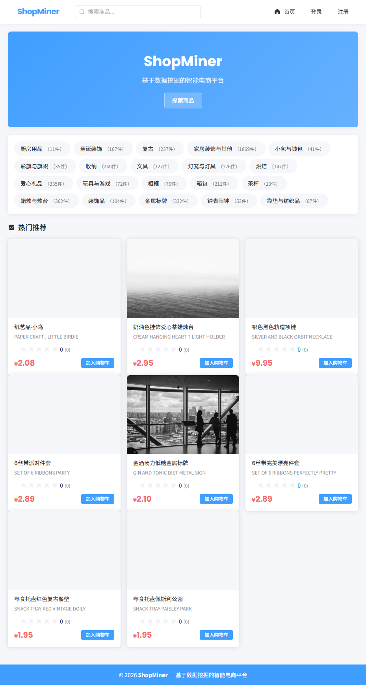
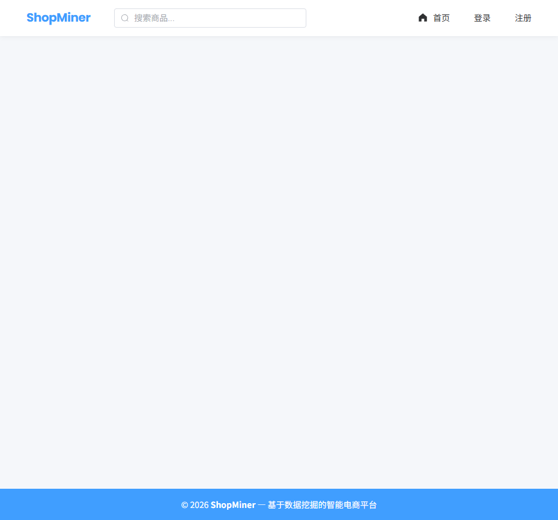
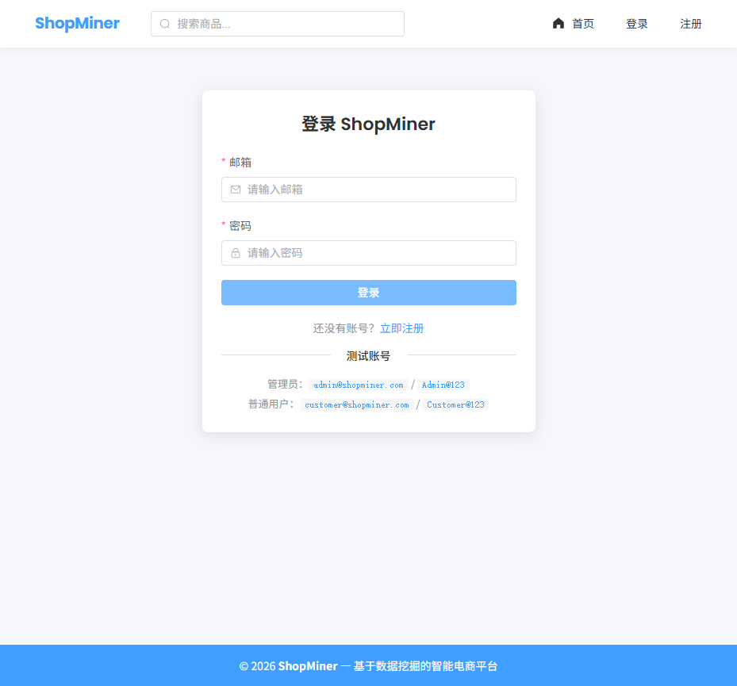
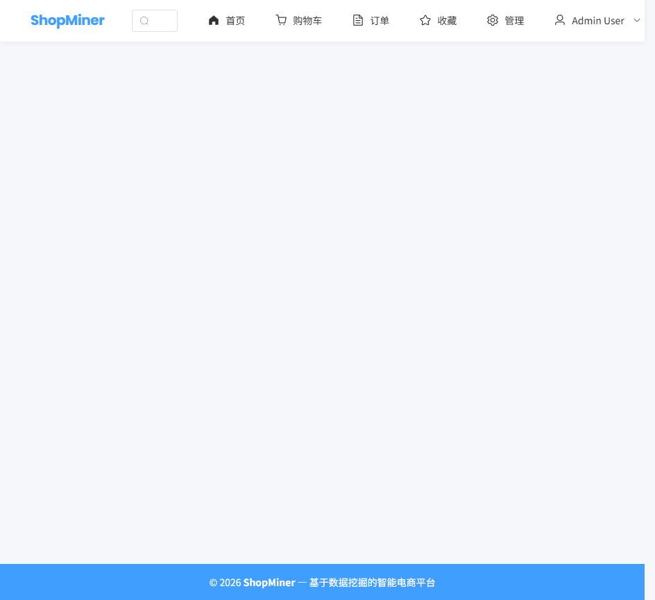

# 🛒 ShopMiner — 基于数据挖掘的智能电商平台

[](https://python.org)
[](https://flask.palletsprojects.com)
[](https://vuejs.org)
[]()
[](docs/coverage/index.html)
[](LICENSE)

> **ShopMiner** 是一个将**数据挖掘**与**电商系统**深度结合的全栈 Web 应用。  
> 它不仅具备完整的电商功能（用户、商品、购物车、订单、支付），更内置了 **RFM 客户分群**、**销量预测**、**流失预警**和**关联规则推荐**四大数据挖掘模块，是一个展示数据科学工程化落地能力的完整项目。

---

## 📖 目录

- [项目亮点](#-项目亮点)
- [技术栈](#-技术栈)
- [系统架构](#-系统架构)
- [数据挖掘核心功能](#-数据挖掘核心功能)
- [电商功能](#-电商功能)
- [截图展示](#-截图展示)
- [快速开始](#-快速开始)
- [测试策略](#-测试策略)
- [面试亮点](#-面试亮点)
- [许可](#-许可)

---

## ✨ 项目亮点

| 亮点 | 说明 |
|------|------|
| **数据驱动** | 四大数据挖掘模块覆盖客户分析、销量预测、流失预警、商品关联，用数据指导运营决策 |
| **全栈工程** | Vue3 + Flask + PostgreSQL 完整前后端分离，RESTful API + JWT 认证 + RBAC 权限 |
| **产品质量** | 443 自动化测试（pytest），代码覆盖率 82%，7 个真实 Bug 修复与回归保障 |
| **真实数据** | 207 张真实商品图片，12 类目种子数据，开箱即用的演示环境 |
| **简历 Ready** | 可直接部署演示，适合数据科学/后端/测试岗位面试展示 |

---

## 🛠 技术栈

| 层级 | 技术 | 用途 |
|------|------|------|
| **前端** | Vue 3 + Composition API | 响应式 SPA |
| | Element Plus | UI 组件库 |
| | ECharts | 数据可视化（RFM 散点图、销量趋势、关联网络图） |
| | Axios | HTTP 请求 |
| | Pinia | 状态管理 |
| | Vue Router | 前端路由 |
| **后端** | Flask 3.0 | Web 框架 |
| | Flask-SQLAlchemy | ORM + PostgreSQL |
| | Flask-JWT-Extended | JWT 认证 |
| | Flask-Limiter | 速率限制 |
| | Flask-CORS | 跨域 |
| **数据挖掘** | Pandas | 数据处理与 RFM 计算 |
| | NumPy | 数值计算 |
| | Scikit-learn | 销量预测（LinearRegression）、流失预警（LogisticRegression） |
| | Apriori 算法 (自实现) | 关联规则挖掘 |
| **测试** | pytest | 单元/集成测试 |
| | pytest-cov | 覆盖率 |
| | Playwright | E2E 测试 |
| **数据库** | PostgreSQL 16 | 主数据库 |
| | SQLAlchemy 迁移 | 表结构版本管理 |

---

## 🏗 系统架构

```
┌─────────────────────────────────────────────────┐
│                   Frontend (Vue 3)                │
│  ┌─────────┐ ┌──────────┐ ┌───────────────────┐  │
│  │ 客户界面 │ │ 管理后台  │ │ 数据挖掘可视化     │  │
│  │ 浏览/下单 │ │ 商品/订单 │ │ RFM/销量/关联/流失  │  │
│  └────┬────┘ └────┬─────┘ └────────┬──────────┘  │
│       │           │                 │             │
└───────┼───────────┼─────────────────┼─────────────┘
        │           │                 │
        ▼           ▼                 ▼
┌─────────────────────────────────────────────────┐
│               REST API (Flask)                   │
│  ┌──────┐ ┌──────┐ ┌──────┐ ┌────────────────┐ │
│  │ 认证  │ │ 商品  │ │ 订单  │ │ 数据挖掘 API    │ │
│  │/auth │ │/product│ │/order│ │ /analytics/*   │ │
│  └──┬───┘ └──┬───┘ └──┬───┘ └───────┬────────┘ │
│     │        │        │              │          │
│  ┌──▼────────▼────────▼──────────────▼──────┐   │
│  │           Service Layer                    │   │
│  │  order_service / product_service / etc     │   │
│  └────────────────┬───────────────────────────┘   │
│                   │                               │
│  ┌────────────────▼───────────────────────────┐   │
│  │         Models + SQLAlchemy ORM             │   │
│  └────────────────┬───────────────────────────┘   │
└───────────────────┼───────────────────────────────┘
                    │
                    ▼
              ┌──────────┐
              │ PostgreSQL 16 │
              │ Database  │
              └──────────┘
```

### API 响应格式

所有 API 统一返回格式：
```json
{
  "code": 200,
  "message": "success",
  "data": { ... }
}
```

---

## 🔬 数据挖掘核心功能

这是本项目的核心差异化能力，也是简历面试的核心展示内容：

### 1️⃣ RFM 客户价值分群

基于最近消费时间（Recency）、消费频率（Frequency）、消费金额（Monetary）三维度将客户分为 8 个价值层级。

| 分群 | 标签 | 运营策略 |
|------|------|----------|
| ⭐⭐⭐ | 重要价值客户 | 最高优先级，VIP 维护 |
| ⭐⭐ | 重要发展客户 | 提升消费频次 |
| ⭐ | 重要保持客户 | 唤醒召回 |
| 一般价值/发展/保持 | 中位客户 | 自动化营销 |
| 一般/流失 | 低价值客户 | 低成本触达 |

> **测试覆盖**：168 个决策表测试验证全部分群逻辑（`tests/unit/test_rfm_segment.py`），含 5×5×5=125 组合全覆盖

### 2️⃣ 销量预测

使用线性回归模型基于历史订单数据预测未来 N 天销量趋势，支持：
- 按日/周/月粒度预测
- 可视化趋势对比（ECharts 折线图）
- MSE 和 R² 模型评估

### 3️⃣ 客户流失预警

基于 Logistic Regression 预测客户流失概率，支持：
- 7 天/30 天流失窗口
- 风险等级分类（高/中/低）
- 流失原因分析

### 4️⃣ 商品关联规则（Apriori）

自实现 Apriori 算法挖掘商品组合购买规律，支持：
- 支持度/置信度/提升度指标
- 可视化关联网络图
- 商品详情页"买了还买"推荐

---

## 🛍 电商功能

| 模块 | 功能 |
|------|------|
| **用户系统** | 注册/登录/充值，JWT 认证，RBAC（管理员/普通用户） |
| **商品管理** | CRUD、分页搜索、分类筛选、图片上传、状态上下架 |
| **购物车** | 增删改查、数量调整、库存校验 |
| **订单系统** | 下单（事务+并发控制）、支付、取消、状态跟踪 |
| **评价系统** | 商品评分、文本评价、按商品聚合 |
| **管理后台** | 商品/订单管理、数据大屏、定价建议 |
| **数据可视化** | ECharts 展示 RFM 散点图、销量趋势、关联网络、流失分析 |

---

## 📸 截图展示

### 首页 & 商品

| 首页 | 商品列表 | 商品详情 |
|:----:|:--------:|:--------:|
|  |  |  |

### 购物 & 订单

| 购物车 | 订单管理 | 登录页 |
|:-----:|:--------:|:-----:|
|  |  |  |

### 管理后台

| 仪表盘 | 商品管理 |
|:------:|:--------:|
|  |  |

### 数据挖掘模块 🌟

| RFM 客户分群 | 销量预测 | 流失预警 | 关联规则 |
|:-----------:|:--------:|:--------:|:--------:|
|  |  |  |  |

---

## 🚀 快速开始

### 环境要求

- Python 3.10+
- PostgreSQL 16+
- Node.js 18+（仅构建前端时需要）

### 1️⃣ 克隆项目

```bash
git clone <your-repo-url>
cd ShopMiner
```

### 2️⃣ 配置数据库

```bash
# 创建 PostgreSQL 数据库

```bash
# 创建 PostgreSQL 数据库
psql -U postgres -c "CREATE DATABASE shopminer;"

# 复制环境变量模板
cp .env.example .env
# 编辑 .env 中的数据库连接信息
```

### 3️⃣ 安装后端依赖

```bash
pip install -r requirements.txt
```

### 4️⃣ 初始化数据库

```bash
flask db upgrade
python scripts/seed_demo_data.py
```

### 5️⃣ 启动服务

```bash
python run.py
# 访问 http://127.0.0.1:5000
```

### 6️⃣ (可选) 构建前端

> 项目已包含预构建的 `frontend_dist/`，可直接使用。如需修改前端：

```bash
cd frontend
npm install
npm run build
# 构建产物输出至 ../frontend_dist/
```

### 演示账号

| 角色 | 邮箱 | 密码 |
|------|------|------|
| 管理员 | `admin@shopminer.com` | `Admin@123` |
| 普通用户 | `customer@shopminer.com` | `Customer@123` |

---

## 🧪 测试策略

### 测试分层

```
┌─────────────────────────────────────┐
│  E2E (Playwright)     5 个场景      │
│  登录 → 选购 → 下单 → 支付 → 后台   │
├─────────────────────────────────────┤
│  集成测试 (pytest)    30+ 个场景     │
│  API 端点测试 + Bug 回归测试         │
├─────────────────────────────────────┤
│  单元测试             198+ 个用例    │
│  RFM 分群(168) + 边界值(21) + 其他  │
└─────────────────────────────────────┘
```

### 运行测试

```bash
# 运行全部后端测试
pytest

# 带覆盖率报告
pytest --cov=app --cov-report=html

# 仅运行单元测试
pytest tests/unit/

# 仅运行 API 测试
pytest tests/api/

# 运行前端单元测试
cd frontend && npm run test:unit
```

### 测试覆盖要点

| 测试类型 | 数量 | 覆盖内容 |
|----------|------|----------|
| RFM 分群决策表 | 168 | 全部分群边界组合验证 |
| 边界值测试 | 21 | 价格/库存/整数边界 |
| Bug 回归测试 | 13 | 7 个历史 Bug 不复发 |
| API 集成测试 | 30+ | 所有业务端点 |
| Playwright E2E | 5 | 核心用户旅程 |
| **总计** | **443** | 覆盖率 **82%** |

---

## 💼 面试亮点

这份代码面试时可以展示的能力：

### 数据科学
- **RFM 模型**从 Pandas 计算到分群策略的完整实现，附 168 个边界测试
- **Apriori 算法**不依赖第三方库的自实现，展示算法理解深度
- **销量预测 + 流失预警**使用 scikit-learn 的工程化落地

### 后端工程
- **RESTful API 设计**统一响应格式，JWT 认证，RBAC 权限
- **并发控制**下单操作使用事务 + `FOR UPDATE` 行级锁
- **防御性编程**7 个历史 Bug 的系统性修复与回归测试

### 测试能力
- **测试分层**：单元 → 集成 → E2E 三层覆盖
- **决策表测试**：168 个 RFM 分群场景全覆盖
- **Bug 驱动测试**：每个修复的 Bug 都有回归测试

### 面试演示建议
1. 现场运行 `pytest` (1-2 秒出结果) → 展示测试工程化
2. 打开 `http://127.0.0.1:5000` 展示 RFM 数据大屏
3. 说明自实现 Apriori 算法细节 → 展示算法功底
4. 指出并发下单的 `FOR UPDATE` 方案 → 展示对并发的理解

---

## 📄 许可

[MIT](LICENSE)

---

> **ShopMiner** — 不只是电商，更是数据挖掘能力的工程化证明。
